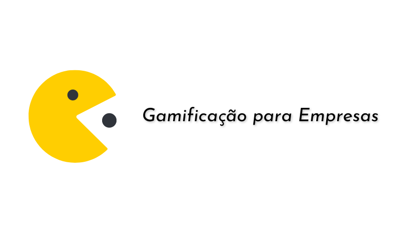

<h1 align="center">
    
</h1>

<h4 align="center"> 
	🚧 Gamificação para Empresas 🚀 em construção... 🚧
</h4>

  

  
 
  

  
   

## 💻 Sobre o projeto

Este projeto é um protótipo de gamificação para empresas e funciona como um sistema de milhagem. Os gestores da empresa estipulam objetivos para os seus colaboradores e caso essa meta seja atingida, o colaborador recebe pontos que poderão ser resgatados posteriormente. 

Após a empresa definir os objetivos, a pontuação e a pontuação, o colaborador poderá entrar na plataforma e consultar os seus pontos, resgatar produtos ou conferir o seu posicionamento no ranking de funcionários.

O projeto busca proporcionar o aumento de rendimento dos colaboradores e também o índice de satisfação por trabalhar em uma determinada empresa.

## 🛠 Tecnologias

As seguintes ferramentas foram usadas na construção do projeto:

- [VueJS][vue]
- [Firebase][firebase]

OBS: Como o objetivo do projeto é apenas ser um protótipo, será necessário implementá-lo de acordo com as necessidades da empresa que irá utilizá-lo, reescrevendo o backend e ajustando a segurança do aplicativo.

## 🚀 Como executar o projeto

Você pode testar o programa <a href="https://andrefmsouza.github.io/gamificacaoparaempresas/">clicando aqui</a>.

## 😯 Como contribuir para o projeto

1. Faça um **fork** do projeto.
2. Crie uma nova branch com as suas alterações: `git checkout -b my-feature`
3. Salve as alterações e crie uma mensagem de commit contando o que você fez: `git commit -m "feature: My new feature"`
4. Envie as suas alterações: `git push origin my-feature`
> Caso tenha alguma dúvida confira este [guia de como contribuir no GitHub](https://github.com/firstcontributions/first-contributions)

## 📝 Licença

Este projeto esta sobe a licença MIT.

Feito com ❤️ por André Souza 👋🏽 [Entre em contato!](https://www.linkedin.com/in/andrefmsouza/)

[license]: https://opensource.org/licenses/MIT
[vue]:https://vuejs.org
[firebase]:https://firebase.google.com